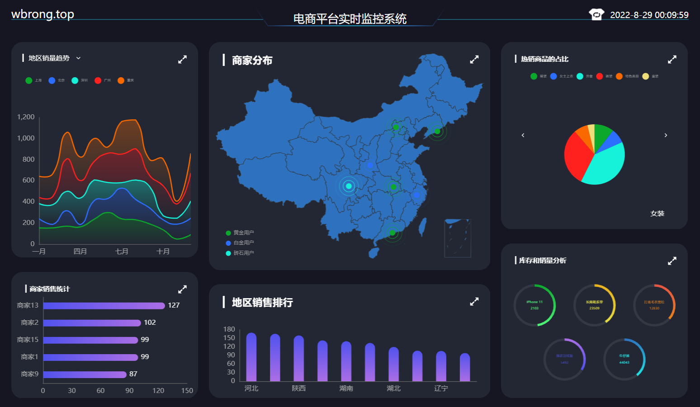

## 电商平台实时监控系统
  

### 技术栈  
`vue2` + `vuex` + `axios` +  `echarts`  + `koa` + `webSocket` + `nodejs`

### 安装
```
npm install
```

### 运行
```
npm run serve
```

### 打包
```
npm run build
```

### vue.config.js自定义配置
See [Configuration Reference](https://cli.vuejs.org/config/).
